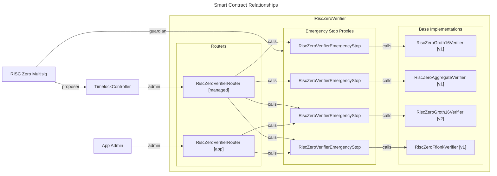

# On-Chain Verifier Upgrade and Deprecation

At base, the RISC Zero verifier contracts are designed to be immutable and stateless.
This meets the highest standards for trust minimized applications on Ethereum, as no action can alter the operation of the verifier.

However, in the event that a security vulnerability is discovered in one or more verifier contracts, stateless contracts require the application to respond to maintain security (e.g. by using governance to remove the vulnerable verifier contract address).
As a countermeasure to this risk, and to allow for upgrades with new features on an opt-in basis, the following version management system is deployed to Ethereum.

## Overview

### Base verifier implementations

Base verifier implementations, such as [RiscZeroGroth16Verifier](./src/groth16/RiscZeroGroth16Verifier.sol), implement cryptographic verification of proofs.
Verifier implementations are generally implemented to be stateless and immutable.
Each base implementation has an associated 4-byte selector value, derived from a hash of a label and its parameters (e.g. Groth16 vkey, and RISC Zero [control root][term-control-root]).

More verifier contracts will be deployed over time, and may add new zkVM circuits, recursion programs, proof systems (e.g. fflonk), batching methods etc.

### Emergency stop

Each base verifier can have an associated [RiscZeroVerifierEmergencyStop](./src/RiscZeroVerifierEmergencyStop.sol) contract.
This contract acts as a proxy, with the addition of an emergency stop function.
When the emergency stop is activated, this proxy will be permanently disabled, and revert on all verify calls.

There are two ways to trigger the emergency stop:

- A call from a designated "guardian" address.
- Activating the "circuit breaker" by proving the existence of a critical vulnerability in the RISC Zero proof system.

RISC Zero deploys and acts as guardian on an emergency stop contract for each of its deployed verifier contracts.
Application developers may also deploy and use their own emergency stop contracts, on which they can assign themselves as guardian.

### Router

A [RiscZeroVerifierRouter](./src/RiscZeroVerifierRouter.sol) allows for multiple verifier implementations to live behind a single address implementing the [IRiscZeroVerifier](./src/IRiscZeroVerifier.sol) interface.
Using the verifier selector included in the seal, it will route each `verify` call to the appropriate implementation.

Implementations can be added to the router mapping by an admin of the router, who is assigned as the owner of the contract.
Implementations can also be removed by the admin, and once removed can never be replaced. I.e. each selector can have at most one implementation across time.

RISC Zero deploys and acts as the admin on a router, maintaining a recommended list of trustworthy verifiers.
Note in particular this means that RISC Zero may add new verifiers, and so a [TimelockController][TimelockController-docs] is put in place to impose a delay on all additions.
If an application using the managed router does not trust a new verifier being added, they will have a time-window to respond.

Applications that require control over the list of accepted verifiers, and want to manage their own list can deploy their own router, pointing to a subset (or disjoint set) of the RISC Zero verifier implementations.

## Usage patterns

Different applications will have different requirements and restrictions on which version of the zkVM they want to accept.

Here are some available usage patterns:

- Use a specific, immutable, and stateless version of the RISC Zero verifier.

  Using `RiscZeroGroth16Verifier` directly accomplishes this.
  It has no state, it cannot be upgraded and it cannot be shutdown, even in the event of vulnerabilities.
  It is up to the application to provide a version management strategy.

- Use a specific version of the RISC Zero verifier, with a shutdown mechanism.

  Using a `RiscZeroVerifierEmergencyStop` contract as a proxy to the verifier accomplishes this.
  Application developers can choose to use an emergency stop proxy deployed and managed by RISC Zero, or can deploy their own.

- Use a list of RISC Zero verifiers, with the ability to add and remove versions from the list. Each version may also support emergency shutdown.

  Using a `RiscZeroVerifierRouter` accomplishes this.
  Applications developers can choose to use the router deployed and managed by RISC Zero, or may deploy their own.

[term-control-root]: https://dev.risczero.com/terminology#control-root
[TimelockController-docs]: https://docs.openzeppelin.com/contracts/5.x/api/governance#TimelockController
