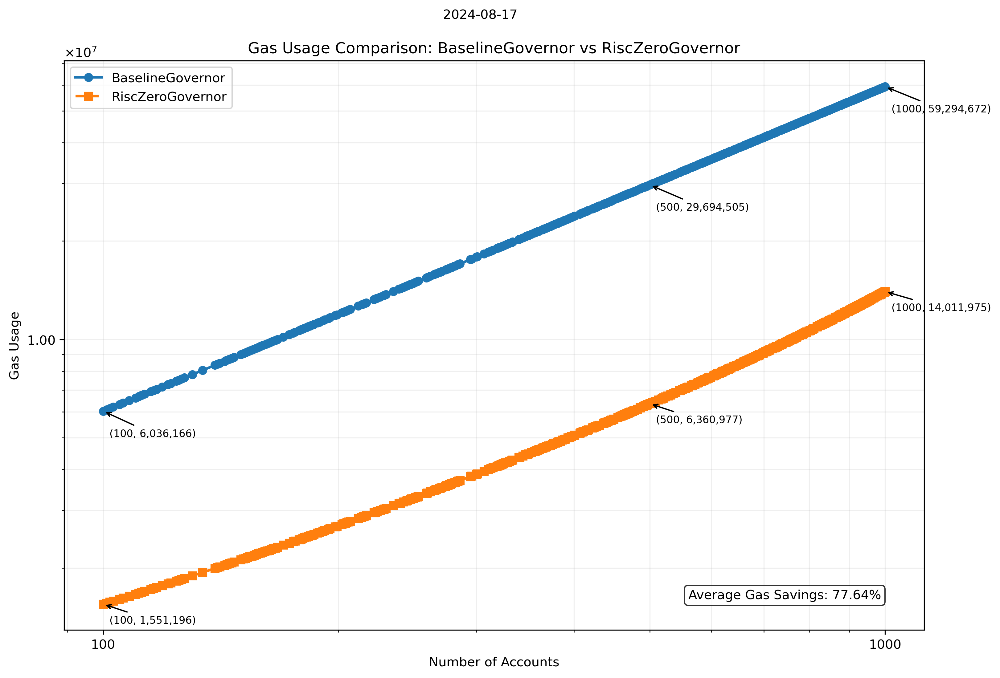

# RISC Zero Governor

## Abstract

This example contains a modified version of OpenZeppelin's [Governor] example, which is the standard for DAO Governance. The modifications have one *end goal*: to **save gas** by taking repetitive and gas intensive computations *offchain*, using RISC Zero's [zkVM], while keeping the necessary trust assumptions intact.

## How much gas is saved?

It depends on how many votes are casted. Concretely, it depends on how many unique accounts cast a vote. The more accounts cast a vote, the more signature verifications are moved from onchain to offchain in the RISC Zero's zkVM.

Using Foundry's gas reporting and fuzz testing, the data were generated using between 100 and 1000 accounts and across 1000 runs for averaging.



## What computation is taken offchain?

[RiscZeroGovernor.sol] has a crucial function `verifyAndFinalizeVotes`:

```solidity
function verifyAndFinalizeVotes(
    bytes calldata seal,
    bytes calldata journal
) public;
```

// TODO
Need to explain what this function does, how it takes vote counting offchain (hash accum still on chain for verification of correct voting and in the right order) and perhaps a standard workflow in BaselineGovernor (i.e. proposal --> voting --> finalisation) and how this works in RiscZeroGovernor.sol.

[Governor]: URL
[RiscZeroGovernor]: URL
[zkVM]: https://dev.risczero.com/zkvm


The Governor contract covers the whole range of Governance 


