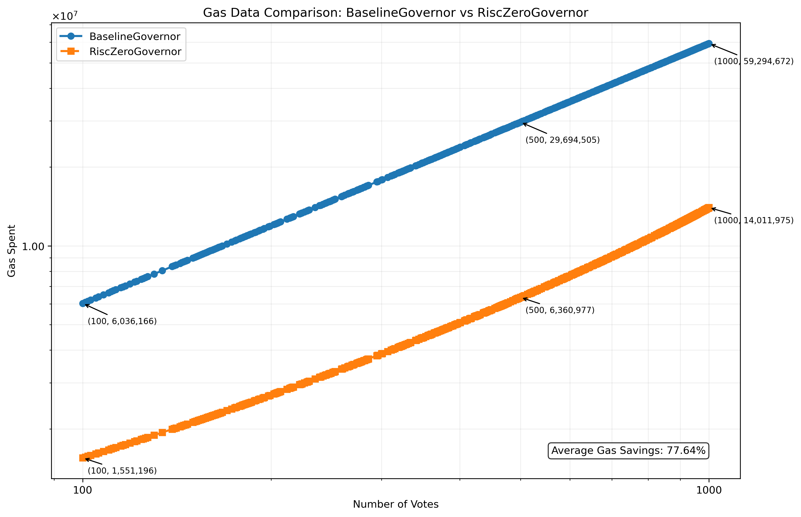

# RISC Zero Governor

To run this example on your machine, follow these [instructions].

## Abstract

This example contains a modified version of OpenZeppelin's [Governor] example, which is the standard for DAO Governance. The modifications have one *end goal*: to **save gas** by taking gas intensive computations *offchain*, using RISC Zero's [zkVM], while maintaining the same trust assumptions.

## How can we take computation offchain and still trust it?

RISC Zero's [zkVM] leverages ZK technology to provide verifiable computation; it does this by proving the correct execution of Rust code. With this proof, anyone can verify that the computation ran correctly and produced the associated outputs.

For blockchain applications, this proof/verify workflow directly enables strong compute scaling. Expensive computation can be taken offchain, while the proof verification can be done onchain. As long as the proof is valid, the associated contract state can be updated; you do *not* have to trust the party that generates the proof (the prover).

You can read more at [What does RISC Zero enable]. 

## How much gas is saved?

The more accounts cast a vote, the more signature verifications ([ecrecover]) are moved from the EVM to RISC Zero's zkVM.



<p align="center">
  <i>Figure 1: A direct comparison of a test voting workflow in BaselineGovernor (the OpenZeppelin implementation) and RiscZeroGovernor (a modified Governor that utilises offchain compute for signature verification. The relevant test files are located in tests/benchmarks. </i>
</p>

The x-axis details the number of votes (also the number of accounts, in the testing workflow, each account votes once), and the y-axis the amount of gas spent. This data was generated using [Foundry], specifically its gas reporting and fuzz testing features. Each workflow with a specific number of votes is run 1000 times to provide an average value. 

## What computation is taken offchain?

The guest program is located at [finalize_votes.rs]. This is the program that runs in the zkVM and a proof of its correct execution is generated. 

At a high level, `finalize_votes.rs`:
- handles signature verification of each vote
- maintains a verifiable hash of all vote data (see `ballotHash` below)
- handles vote updates (only latest vote per address counts)

## How is this verified onchain?

[RiscZeroGovernor.sol] has an important function `verifyAndFinalizeVotes`:

```solidity
    function verifyAndFinalizeVotes(
        bytes calldata seal,
        bytes calldata journal
    ) public {
        // verify the proof
        verifier.verify(seal, imageId, sha256(journal));

        // decode the journal
        uint256 proposalId = uint256(bytes32(journal[0:32]));
        bytes32 ballotHash = bytes32(journal[32:64]);
        bytes calldata votingData = journal[64:];

        _finalizeVotes(proposalId, ballotHash, votingData);
    }
```

This function calls a RISC Zero [verifier contract] to verify the RISC Zero `Groth16Receipt` produced by the prover. If this proof is invalid, the execution will revert within this call, otherwise the [journal] is decoded and the `_finalizeVotes` function within `RiscZeroGovernorCounting.sol` is called. `_finalizeVotes` handles the votes committed to the journal in 100 byte chunks in `votingData`.

When a user votes, this has both an onchain and an offchain aspect. The vote is processed offchain as seen in [finalize_votes.rs], and onchain `castVote` is called ([RiscZeroGovernor.sol]), which commits the vote by hashing its vote support (a `uint8` representing the vote state, i.e. 1 represents a `for` vote) and the account's address with a hash accumulator of all previous votes.

This hash accumulator (`ballotHash`) is a commitment that allows offchain voting state to be matched with state onchain; the order of voting will change the final hash and so `ballotHash` is a running representation of voting in an exact order. If an account votes more than once, there is logic to handle only its latest vote as the valid vote, but its data for previous votes is still hashed into `ballotHash`.

[ecrecover]: https://docs.soliditylang.org/en/latest/cheatsheet.html#index-7
[finalize_votes.rs]: ./methods/guest/src/bin/finalize_votes.rs
[Foundry]: https://book.getfoundry.sh/
[Governor]: https://docs.openzeppelin.com/contracts/4.x/governance
[instructions]: ./instructions.md
[journal]: https://dev.risczero.com/terminology#journal
[RiscZeroGovernor.sol]: ./contracts/src/RiscZeroGovernor.sol
[verifier contract]: https://dev.risczero.com/api/blockchain-integration/contracts/verifier
[What does Risc Zero enable]: https://dev.risczero.com/api/use-cases
[zkVM]: https://dev.risczero.com/zkvm


