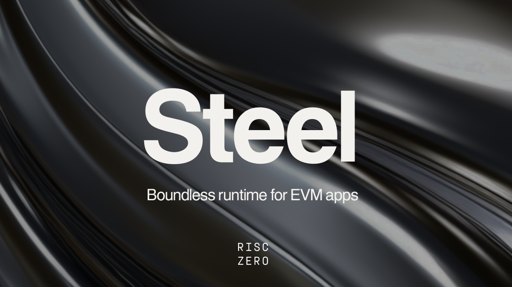

# Steel - Boundless runtime for EVM apps

## Introducing Steel, a production-ready smart contract execution prover

Steel is a production-ready smart contract execution prover designed to bring boundless runtime to all EVM apps. Using execution proofs, Steel enables EVM apps to run offchain, while preserving onchain security. With Steel, you can prove correct smart contract execution without re-execution, allowing blockchain developers unbounded computation over on-chain data.

Our partners are already developing game-changing applications with Steel. One application has shown gas savings of 1.2 billion gas for a contract call using around 400,000 SLOADs. 1.2 billion gas is around 30 blocks worth of execution and this can be verified onchain in one proof, that costs under $10 to generate, and less than 300k gas to verify. Steel unlocks boundless application runtime, without rollups, without centralization, without re-writing your smart contracts, and without writing ZK circuits. The brakes are off.

## Getting Started with Steel

The recommended place is to start is [Steel examples], specifically the [ERC20 Counter] example.

The [create-steel-app] script will allow you to set up the erc20-counter example locally in one command:

```sh
sh <(curl -fsSL https://raw.githubusercontent.com/risc0/risc0-ethereum/refs/heads/main/steel/docs/create-steel-app/create-steel-app)
```

This example acts as your skeleton project structure for further development. Once the script is finished, you can run through a test workflow with either local proving or Bonsai proving. The documentation below uses the ERC20-counter example as a guide to explain Steel in detail.

You can watch this [video tutorial] for a quick runthrough of using the create-steel-app script to get started.

## Documentation

This documentation covers the core concepts of Steel. After reading, you will understand how Steel creates verifiable EVM execution proofs allowing you to carry out execution off-chain verifiably.

- [Introducing Steel 1.0] (blog post)
- [What is Steel?]
- [How does Steel work?]
  - [Proving EVM execution within the zkVM]
  - [Verifying the Proof On-Chain]
- [Steel Commitments]
  - [Trust Anchor: The Blockhash]
  - [What is a Steel Commitment?]
  - [Validation of Steel Commitments]

## Further Reading & Ask Questions

The RISC Zero [dev docs][dev-docs] are a great place to start to understand the zkVM in detail. If you have any questions, and/or just want to hang out with other builders, please join the [RISC Zero Discord][risczero-discord].

[Steel examples]: ../examples
[ERC20 Counter]: ../examples/erc20-counter
[create-steel-app]: docs/create-steel-app
[video tutorial]: https://www.loom.com/share/0e2ede7b9d50464fb729819a8bd24e05?sid=3009618b-38ea-449a-90dc-9b39ef569c67
[Introducing Steel 1.0]: https://risczero.com/blog/introducing-steel-1.0
[What is Steel?]: docs/what-is-steel.md
[How does Steel work?]: docs/how-does-steel-work.md
[Proving EVM execution within the zkVM]: docs/how-does-steel-work.md#proving-evm-execution-within-the-zkvm
[Verifying the Proof On-Chain]: docs/how-does-steel-work.md#verifying-the-proof-on-chain
[Steel Commitments]: docs/steel-commitments.md
[Trust Anchor: The Blockhash]: docs/steel-commitments.md#steels-trust-anchor-the-blockhash
[What is a Steel Commitment?]: docs/steel-commitments.md#what-is-a-steel-commitment
[Validation of Steel Commitments]: docs/steel-commitments.md#validation-of-steel-commitments
[dev-docs]: https://dev.risczero.com/api/
[risczero-discord]: https://discord.com/invite/risczero
